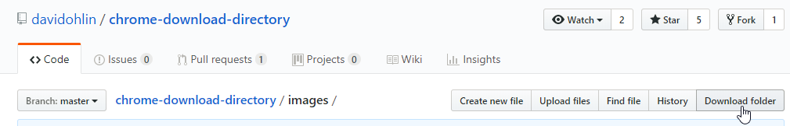

# 🎁 chrome-download-directory

Chrome extension that adds a button to download subdirectories from a Github repository.

This project is using [download-directory](https://github.com/download-directory/download-directory.github.io) by [Federico Brigante](https://github.com/bfred-it).

## Install
You can install this extension easily through Chrome's Web store. 
Simply head to the link below and hit the green "Add" button, placed at the top right.

[Chrome Web Store](https://chrome.google.com/webstore/detail/github-download-directory/ainhcbodabdlbggjhcbjhghmpjapgmmn)

## License

MIT © [David Öhlin](http://github.com/davidohlin)
